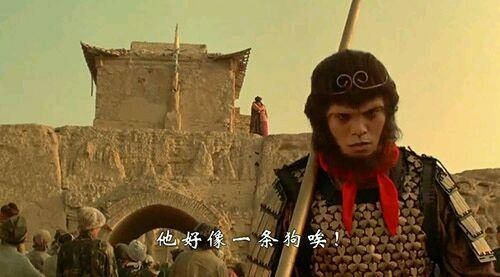
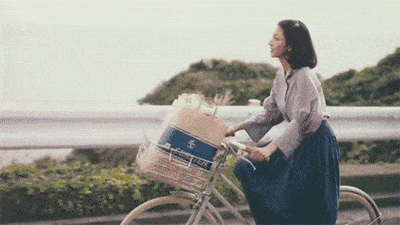
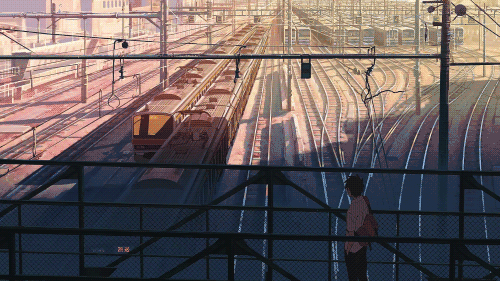

~~曾经看到过这样一句话：**“生活就是日复一日,周而复始,不断重复与停歇。其实,什么也没有改变。”**且不去争论这句话是对是错，至少于我而言，确实如此。~~

~~也正因如此，所以我很少发说说、动态等，因为确实没有什么值得分享的事。直到大约一星期前，在群里和沙雕网友聊天时不知怎么得就聊到了这个话题，这才让我萌生了写下这篇文章的念头。~~

正经的序——**“千呼万唤始出来，犹抱琵琶半遮面。”**

“那个人样子好怪。” “我也看到了，他好像一条狗。” 大话西游的最后一句对白你还记得么。在我看来这一句，就是整个电影的主题。用一句话来说就是：身为一个人的无奈...

以前我曾幻想毕业几年后的生活会是怎么样的。~~挺着啤酒肚~~、收获了甜美的爱情、生活稳定开着车子...此刻我均没有。

刚毕业后的几年，应该算是比较迷茫的的年龄了，那么我迷茫吗，没的说。恐惧于职场的社交、忧虑于工作的选择、而又期望于未来的生活。

那么迷茫就不对吗？从某种角度来讲，迷茫是一件好事情，说明你对现状进行了思考，对目前状态有改变的期望，同时又对接下来改变后的未来不确定性，所以才迷茫。所以说迷茫不是错，迷茫之后没有行动没有改变才是问题。可以给自己一段时间，在这个时间内，进行充分的了解选择后的结果，以及对自身定位，在这个时间段之后，就果断的行动，不要拖拉。

我是在杭州读书的，因此毕业之后也便顺势租了个公寓留在了杭州。接下来的生活便如预料中的一样，过上了公寓到公司之间两点一线的996生活。直到这样的生活持续了一年以后，我扪心自问，这样的生活真的是我想要的吗？于是我毅然决然的选择了辞职跑路。

以上都是我瞎编的，年少轻狂，哪有这么多理由，纯粹是因为感觉太累了不想干了而已，身为一只死宅单身狗，积攒了点钱后又哪能不过一过纸醉金迷（bushi）的咸鱼生活呢？

刚开始的那段时间，如果要用一个字来形容，就是爽，两个字，真爽，这才是人该过的生活啊。我租的公寓是在一个小区里，正巧我楼下就有小卖部，还能收发快递，每天就是吃了睡睡了吃，加上我个人比较喜欢偏暗一点的环境，所以我一直拉着窗帘，那会是夏天比较热，空调也没有关过，生存在这样的环境中，仿佛感觉不到时间的流逝。一晃眼便过去了三个月，身体每况愈下不说，我遇到了一个很现实的问题，我没钱了。后来的经过这里便先不说了，下一篇可以考虑聊一聊，继续说回开篇所说的。

“你看那个人，他好像一条狗。”至尊宝为了救紫霞，只得戴上金箍变成孙悟空，而想戴上金箍却又必须斩断七情六欲，你拥有了一些东西，却也永远的失去了一些东西。

英国哲学家罗素有一句话是这样说的：**“你能在浪费时间中获得乐趣，就不是浪费时间。”**想起这句话是因为看到了有人这样说：她说，前几年一心想着努力赚钱。每天的节奏都特别赶，直到生了一场大病。**从医院出来，才发现只要能健康地活着，就是最重要的幸福。**

我时常在想，20岁时的快乐和30岁时的会是一样的吗？答案必然是否定的。有些东西、有些事情，只有在正确的时间、亦或是正确的地点，才能不留下遗憾。《后会无期》里说：**“听了很多道理，却依然过不好这一生。”**有人三分钟泡面，有人三小时煲汤。有人996职场厮杀，有人只愿时光闲散一生悠闲。人和人生活节奏不一样，想要的生活方式也不一样。**道理都是别人说的，耳朵和心，是你自己的。**

**生活啊，都是要一个人去摸索出一条属于自己的路的。**

我想你一定也听过一些来自于别人的道理。初入社会，听人说银行卡里日益增长的数字才是最大的安全感。于是卯足了劲拼命往前冲。**可后来慢慢地，却觉得自己不知道在什么时候失去了很多东西。**只听信所谓的“真理”而忽视了自己内心真正感受的结果就是：感觉自己似乎很久都没有肆意地开怀大笑过了。

之前看到过这样一个故事，她说疫情之后她和老公都被公司降薪了。本来好容易手头宽裕了一点。现在每个月除了房贷车贷生活费，又剩不下什么了。但她的语气并没有抱怨和迷茫，反而是一如既往努力地热爱生活。**她说，她很珍惜现在的日子，即使不够完美，但在她心里，就是满分的幸福。**虽然买不起奢侈品包包，但想出去吃饭的时候，有打一个电话就能约到的朋友；虽然没有住上两百平的房子，但家人都身体健康，想爸妈的时候一个小时就能回家；虽然另一半一直都没戒烟成功，但每一个节日他都会精心准备礼物，有时候噩梦睡醒看到他在身边，就又会继续安心睡去了；因为家里有人等，所以只要工作结束了就会回家；因为周末很难得，所以总是早早地计划着去哪里打卡新体验。**对他们来说，挣钱很重要，但生活更重要。**

**过自己想要的生活，上帝会让你付出代价。但最后这个完整的自己，就是上帝还给你的利息。**

**一切听从心的选择，都会是最好的选择。**

**发生本身，即是意义。**

特别喜欢海桑的那首《给我的孩子》，诗里写着：“突然间有个想法，想自己一夜间变老，这样就能看见你长大后的样子了。你不是我的希望，不是的，你是你自己的希望。我那些没能实现的梦想还是我的，与你无关，就让它们与你无关吧。你何妨做一个全新的梦，那梦里不必有我。其实在生命的意义上我们都是奇迹。就像未来不会比现在更重要，你我也只能是对方人生的某个部分。”

所以，你不必活成别人理想的样子。**那些道理你可以听，但不要盲从。只此一生，尽可能地，去过你喜欢的日子。愿你我出走半生，初心不改，永远年轻。**

  
END

