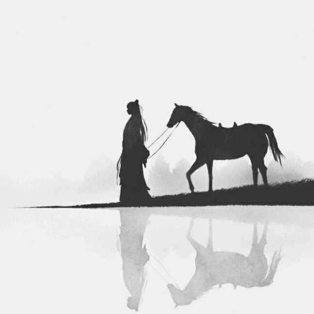

今天在知乎看到一个很有意思的提问，女大学生闺蜜在当情妇，我要不要劝她？

**其实聪明的人是不会去劝别人什么的，甚至连有血缘关系的人都不怎么劝的**

**就算你的个人修行已经很高了，也一定不能轻易渡人，包括这一世的父母，你要做的是，让他们做自己，而自己不被影响和消耗。**

**每个人有每个人自己的因果，当你说出自己的正见超出了他人的认知，他会本能的拒绝，就算他不想拒绝，说了也没意义**

因为他身上的无形众生不允许你传递你的正知正念，除非他是主动向你请教的，那就是缘分到了，否则不要试图做一个救世主。

更何况朋友用不着你兜，也不该你兜。

**你在走一条路，你有一个终点，你发现有一个人跟你终点是一样的，你们一起上路，那这个人就是朋友**

**如果她做事的方式方法以及思维都得不到你的认可，那这个朋友的内核实际上已经崩塌了。**

哪怕你们一起长大又怎么样？

只剩一个叫“朋友”的空壳子了，实际上已经不复不存在了。

人需要在互相认可的价值中走下去，创造更多的“感情基础”，这才是真正的友谊归宿。

**而当我们大多数人逐渐有了自己的人生观价值观，有了自己的原则和看法，越坚持走自己的路，越坚持自己的选择，就会越来越孤独，跟以往的朋友之间的距离便不知不觉越来越远。**

**这种“远”，与其说是物理距离的“远”，不如说是心理距离的“远”，而这正正因为：不认同。**

在我看来，我一直提倡承受孤独，享受孤独，是走上成熟必经的一条道路。

**真正的朋友，资源、地位、见识一定相当。即便有些友谊，看起来超越阶级，但观念的水位，也一定是相近的。**

而对逐渐不认同的朋友及其生活方式，人会产生排斥感，会有理性判断默默地提醒自己，这段友谊已不值得投资、这段友谊已没有未来。

人不会总活在过去，活在“感情基础”中；

连表达都是多余的，人只需要走自己的路，别人来了一起走，谁离开了就好聚好散。

**人需要在互相认可的价值中走下去，创造更多的“感情基础”，这才是真正的友谊。**

你将一个朋友拉入黑名单，必然也将另一个人“通过好友申请”。

你被一个朋友圈“好走，不送”，也代表着被另一个朋友圈“欢迎光临”。

**而我的建议是不要拉朋友上路，而是在路上找朋友。**

**菩萨心是什么？菩萨心是不言不语自修行。**

**正所谓天雨虽大，不润无根之草，道法虽宽，只渡有缘之人。**

  
END

